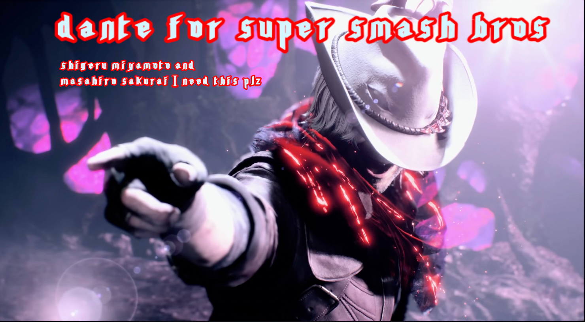

Nintendo Has *ONE* Rule for New *SSB* Characters
============================================
*A character must originate from a video game to be added into Super Smash Bros.*
---------------------------------------------------------------------------------
- As much as people want it, Goku will not make it to a *Super Smash Bros* game because of this rule.
- It is possible for Nintendo to change this rule, but other than the demand for certain characters, they have no reason to.
- I, however, have a pitch to add a different character that would meet this singular rule.

Why & How Nintendo Should Add Dante from DMC to the Next *SSB* Game
=================================================================
*AKA a topic that I will definitely spend too much time talking about.*

Who Is Dante?
-------------
- Dante is a character in a video game series called *Devil May Cry*.
- In most games, Dante is the protagonist. At the very least, he's always playable.
- *Devil May Cry* and Dante were first created by Hideki Kamiya while he worked at Capcom. **Remember this later.**

My Reasons for Dante
--------------------
- Out of all the *DMC* characters, he and his twin brother, Vergil, are arguably the most recognizable.
- Hideki Kamiya also created the character Bayonetta for Capcom along with her game, so it would be fitting since she is in SSB Ultimate.
- The *DMC* games are filled with different combat styles and combos, so there's a variety of things to choose from with his moveset.

Making Dante Work for *SSB*
-------------------------
Two boxes must be checked for Dante to work here:
- [x] Does he originate from a video game?
- [ ] Can we make a move set for him that works for SSB?

We've already checked the first, so all we need to do is prove the second. And by we, I mean me. You just . . . read my overly-passionate reasoning, I guess.

### Different Moves in *SSB*
In *SSB*, each fighter has the same amount of attacks with their buttons. Some have unique combos or abilities (ex. Some can counter). Here's a list of them below:
#### Smash Attacks
These are the standard attack moves without much variety between characters, performed by pressing the A button.
1. Standard Attack: Pressing the A button without moving does a fast and normal attack.
2. Smash Attack: Pressing the A button while tilting the left analog stick up, down, left, right, or diagonal will do a more unique attack. There can be a bit of variety to this when you're in the air.

#### Special Moves
These are attacks that are more unique to the characters. There's more variety between them, so I'll just give an overview of what each one usually is. These are all done by pressing the B button.
1. B: There isn't really any way to generalize the B button other than that holding it usually makes the attack stronger.
2. Side B: This is a bit more easy to generalize, as it's usually some form of projectile, rush, or ranged attack.
3. Up B: Also a bit more easily generalize, the Up B is usually some sort of rush into the air, or it's grabbing something in the air. Either way, as long as it has a big enough range, it's useful for recovery.
4. Down B: Sometimes it's a down rush when you're in the air, sometimes it's a counter, sometimes it's to switch move sets*.
   - *Example: Joker is able to summon his persona, Arsene.
   - *Example: Pyra can switch to Mythra.
6. Final Smash: After you destroy a Smash Ball, you can press B to use your Final Smash. There is no way to generalize this. Each one is unique, but they usually do major damage or are very useful in some way.

### Creating Dante's Move Set
When adding a character into *SSB*, Nintendo also has to consider whether they can feasibly give them a move set that works for *SSB*, so in the tables below I've said what I think Dante's move set could be. If he seems a bit too overpowered, then just remember that I do not work for Nintendo, A, and B, he could be added in the next *SSB* game either as unlockable through the story campaign or as DLC, and DLC characters tend to be overpowered anyways.

#### Smash Attacks
| Standard Attack | Side Smash | Up Smash | Down Smash |
| --------------- | ---------- | -------- | ---------- |
| Standard slash attack using Dante's sword from *DMC5*, Devil Sword Dante, which he unlocks in the story. | Stabbing or jabbing more using Devil Sword Dante. | Upwards slash using Devil Sword Dante. | Sweeping slash using Devil Sword Dante. |

#### Special Moves
| B | Hold B | Side B | Up B | Down B | Final Smash |
| - | ------ | ------ | ---- | ------ | ----------- |
| Dante throws Dr. Faust, a hat that he gains and uses to attack enemies *DMC5*. | Dante throws Dr. Faust and it stays in the air attacking for a few seconds (I'm thinking a still spin). | Dante shoots enemies using his pistols *Ebony* and *Ivory*. | Dante spins uses his [Highside move with Cavalier] to do a large-range attack that scoops the enemy into the air. | Similar to how Joker has a meter that, once filled, allows him to use Down B to temporarily summon Arsene, Dante will have a meter that, once filled, allows him to use Down B to temporarily turn into his Devil Trigger form. | Dante temporarily turns into his Sin Devil Trigger form, which will boost the amount of damage and range that his attacks normally have. |

[Highside move with Cavalier]: https://www.youtube.com/watch?v=SGnhOV1Hp7g
